<div align="center">


</div>

<div align="center">

[](https://discord.com/users/.q0n)

</div>

---

<div align="center">

```
▄▄▄▄▄▄▄▄▄▄▄▄▄▄▄▄▄▄▄▄▄▄▄▄▄▄▄▄▄▄▄▄▄▄▄▄▄▄▄
█░░░ WHO AM I ░░░░░░░░░░░░░░░░░░░░░░░░░█
▀▀▀▀▀▀▀▀▀▀▀▀▀▀▀▀▀▀▀▀▀▀▀▀▀▀▀▀▀▀▀▀▀▀▀▀▀▀▀
```

</div>

```yaml
name      : psychoray
status    : existing... barely
mood      : [ ██████░░░░ ] perpetually tired
purpose   : unknown
found_in  : the darkest corner of the internet
```

---

<div align="center">

```
▄▄▄▄▄▄▄▄▄▄▄▄▄▄▄▄▄▄▄▄▄▄▄▄▄▄▄▄▄▄▄▄▄▄▄▄▄▄▄
█░░░ ARSENAL ░░░░░░░░░░░░░░░░░░░░░░░░░░█
▀▀▀▀▀▀▀▀▀▀▀▀▀▀▀▀▀▀▀▀▀▀▀▀▀▀▀▀▀▀▀▀▀▀▀▀▀▀▀
```

</div>

<div align="center">


</div>

---

<div align="center">

```
▄▄▄▄▄▄▄▄▄▄▄▄▄▄▄▄▄▄▄▄▄▄▄▄▄▄▄▄▄▄▄▄▄▄▄▄▄▄▄
█░░░ GITHUB METRICS ░░░░░░░░░░░░░░░░░░░█
▀▀▀▀▀▀▀▀▀▀▀▀▀▀▀▀▀▀▀▀▀▀▀▀▀▀▀▀▀▀▀▀▀▀▀▀▀▀▀
```

</div>

<div align="center">



</div>

<div align="center">


</div>

---

<div align="center">

```
▄▄▄▄▄▄▄▄▄▄▄▄▄▄▄▄▄▄▄▄▄▄▄▄▄▄▄▄▄▄▄▄▄▄▄▄▄▄▄
█░░░ QUOTE ░░░░░░░░░░░░░░░░░░░░░░░░░░░░█
▀▀▀▀▀▀▀▀▀▀▀▀▀▀▀▀▀▀▀▀▀▀▀▀▀▀▀▀▀▀▀▀▀▀▀▀▀▀▀
```

*"The loneliest people are the kindest.*
*The saddest people smile the brightest.*
*The most damaged people are the wisest."*

</div>

---

<div align="center">


</div>
